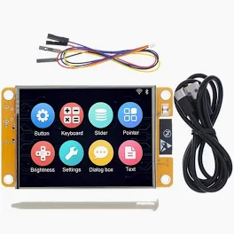

# ESP32-Cheap-Yellow-Display



Arduino Libraries:

-  TFT_eSPI
-  lvgl
-  XPT2046_Touchscreen

Configuration files:

- Replace `C:\Users\XXX\Documents\Arduino\libraries\TFT_eSPI\User_Setup.h` with `User_Setup.h` in this repo.
- Copy `lvgl.h` to the folder `C:\Users\XXX\Documents\Arduino\libraries\`

Folder structure:

```
├───lvgl
├───TFT_eSPI
    └───User_Setup.h
├───XPT2046_Touchscreen
└───lvgl.h
```

